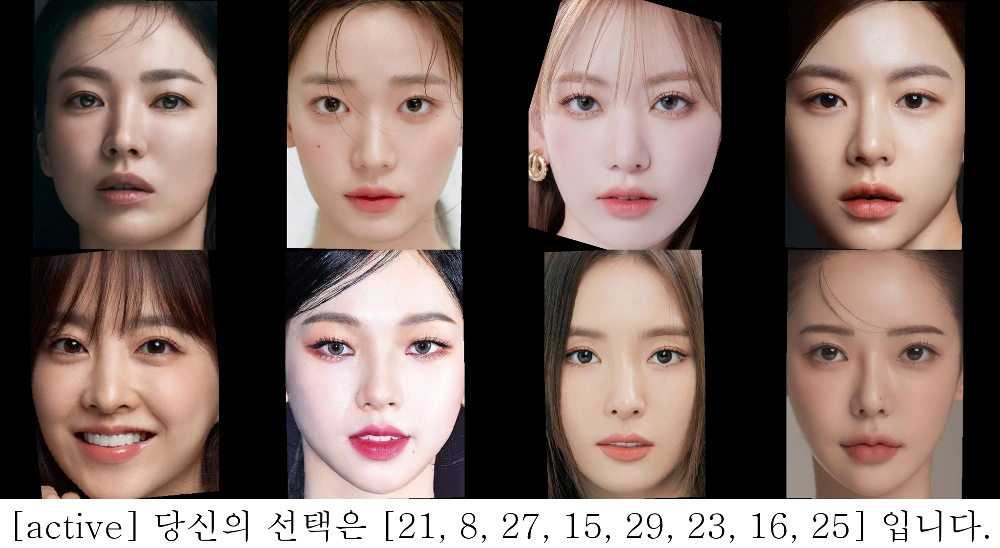

# P300을 활용한 이상형 이미지 구현

---

# Abstract

사용자의 이상형을 구현해주는 시스템입니다. 여러 연예인의 이미지를 제시한 후 P300이 가장 높았던 몇 장의 이미지를 후보군으로 선택한 뒤 그 후보군들의 특징을 합쳐서 새로운 사용자만의 이상형의 이미지를 생성해줍니다.

# 결과 예시




**active 이상형 생성**


**passive 이상형 생성**

# 과정

1. **데이터 수집 및 전처리**
    1. **이상형 선택지로 사용할 연예인 이미지 크롤링**
        1. 구글 이미지 검색: 1500장 수집
        2. 핀터레스트: 1155장장 수집 
    2. **Face Detection, 정렬 및 Crop**
        1. mtcnn 이용
        2. face detection 및 정렬 수행 후 (1024x1024) 크기의 이미지로 crop
2. **실험 및 이상형 후보군 선정**
    1. **실험(자극 시스템)**
        1. 사용자에게 자극 시스템을 제시하여 EEG 측정
        2. 사용자에게 사진이 매력적으로 느껴진다면 스페이스바를 누르도록 사전 공지
        3. 무작위 순서의 30장 얼굴 사진을 1초씩 사용자에게 제시
    2. **P300 detection**
        1. 필터링: lowcut = 1, highcut = 15
        2. Grand Average 수행 (task 5번 수행 후)
        3. 자극 제시 후 0.1~0.45초 사이 amplitude의 MAX 값을 P300으로 설정
    3. **이상형 후보군 선정**
        1. Active와 Passive한 결과에 대한 모든 recommendation 제시
        2. Active: 스페이스바를 누른 자극 기준과 P300 값으로 정렬을 진행하여 상위 8개 후보군으로 채택
        3. Passive: P300의 amplitude 값이 가장 큰 순으로 정렬을 진행하여 상위 8개 후보군으로 채택
3. **이상형 이미지 구현 (with StyleGAN)**
    1. **latent vector 임베딩**
        1. 실험 task에 쓰인 30장의 사진들을 Image2StyleGAN를 이용해 임베딩
    2. **새로운 이상형 latent vector 생성**
        1. 후보군 latent vector들의 가중합 진행
        2. 이미지 순위별 가중치: [0.5, 0.3, 0.1, 0.05, 0.02, 0.01, 0.01, 0.01]
    3. **이상형 이미지 구현**
        1. 새로운 이상형 latent vector와 StyleGAN을 이용해 이상형 이미지 구현

# 실행방법

```bash
# /main/train/erp_ideal_type_main.py의 python shell에 해당 명령어를 입력
python erp_ideal_type_main.py --num_trials 5 --num_images 30 --lowcut 1 --highcut 15 --result_dir_num 5 --recommendation_num 8
# --뒤의 인자들은 argument parser이므로 실험 설정에 따라 적절히 조절
# --result_dir_num 의 값에 따라 수행결과 폴더들이 달라짐

# 실행 시: C:/MAVE_RawData/의 가장 최신의 데이터를 가져와서 사용(EEG 데이터)
# 실행 시: main/images/females/의 이미지 30장을 가져와서 task 수행
# 수행 결과: /main/data/result_dir_num/ 에 EEG raw data csv 파일 저장
# 수행 결과: /main/event/result_dir_num/ 에 event 정보가 반영된 csv 파일 저장
# 수행 결과: /main/plot/result_dir_num/ 에 이미지 별 grand average 수행한 EEG 그래프 저장
# 수행 결과: /main/result/result_dir_num/ 에 후보군 이상형 이미지와 생성된 이상형 이미지 저장
```

# 환경

### 1. **폴더 구조**

```markdown
PROJECT
**│   ├── crawling/
│   │   ├── chromedriver.exe
│   │   ├── crawling_google.py
│   │   ├── crawling_pinterest.py
│   │   ├── face_preprocessing.py
│   │   ├── crawling_images/
│   │   │   ├── images_crop_1024/
│   │   │   ├── images_crop_1024_30/
│   │   │   ├── images_google/
│   │   │   ├── images_pinterest/
│   ├── main/
│   │   ├── data/
│   │   │   ├── 해당 날짜/
│   │   │   │   ├── Rawdata_시간.csv
│   │   ├── event/
│   │   │   ├── 해당 날짜/
│   │   │   │   ├── ideal_type_event_시간.csv
│   │   ├── images/
│   │   │   ├── backgrounds/
│   │   │   ├── females/
│   │   │   ├── males/
│   │   ├── plot/
│   │   │   ├── females/
│   │   │   │   ├── result_dir_num/
│   │   │   ├── males/
│   │   │   │   ├── result_dir_num/
│   │   ├── result/
│   │   │   ├── females/
│   │   │   │   ├── result_dir_num/
│   │   │   ├── males/
│   │   │   │   ├── result_dir_num/
│   │   ├── src/
│   │   │   ├── analysis.py
│   │   │   ├── iir.py
│   │   │   ├── plot.py
│   │   │   ├── preprocess.py
│   │   │   ├── recommendation.py
│   │   │   ├── task.py**
**│   │   ├── StyleGAN/**
│   │   │   ├── dnnlib/
│   │   │   │   ├── __init__.py
│   │   │   │   ├── util.py
│   │   │   ├── metrics/
│   │   │   │   ├── stylegan3-r-ffhqu-1024x1024.pkl
│   │   │   │   ├── stylegan3-t-ffhqu-1024x1024.pkl
│   │   │   ├── torch_utils/
│   │   │   │   ├── __init__.py
│   │   │   │   ├── custom_ops.py
│   │   │   │   ├── misc.py
│   │   │   │   ├── ops/
│   │   │   │   │   ├── __init__.py
│   │   │   │   │   ├── bias_act.cpp
│   │   │   │   │   ├── bias_act.cu
│   │   │   │   │   ├── bias_act.h
│   │   │   │   │   ├── bias_act.py
│   │   │   │   │   ├── conv2d_gradfix.py
│   │   │   │   │   ├── conv2d_resample.py
│   │   │   │   │   ├── filtered_lrelu.cpp
│   │   │   │   │   ├── filtered_lrelu.cu
│   │   │   │   │   ├── filtered_lrelu.h
│   │   │   │   │   ├── filtered_lrelu.py
│   │   │   │   │   ├── filtered_lrelu_ns.cu
│   │   │   │   │   ├── filtered_lrelu_rd.cu
│   │   │   │   │   ├── filtered_lrelu_wr.cu
│   │   │   │   │   ├── fma.py
│   │   │   │   │   ├── grid_sample_gradfix.py
│   │   │   │   │   ├── upfirdn2d.cpp
│   │   │   │   │   ├── upfirdn2d.cu
│   │   │   │   │   ├── upfirdn2d.h
│   │   │   │   │   ├── upfirdn2d.py
│   │   │   │   ├── persistence.py
│   │   │   │   ├── training_stats.py
**│   │   │   ├── save_images/**
**│   │   │   ├── images/
│   │   │   ├── latent/
│   │   │   ├── weights_test.ipynb
│   │   │   ├── generate_ideal_type.py
│   │   │   ├── make_latent_vector.ipynb**
**│   │   ├── erp_ideal_type_main.py**
**│   ├── 신경공학 기말 보고서_이환수_최예빈.pdf
│   ├── README.md**
```

- **crawling/ :** 크롤링 진행 폴더
    - **crawling_google.py :** 구글에서 이미지 크롤링하는 python 파일
    - **crawling_pinterest.py :** 핀터레스트에서 이미지 크롤링하는 python 파일
    - **face_preprocessing.py :** face detection, 정렬, crop 진행하는 python 파일
    - **chromedriver.exe :**  크롬 드라이버. selenium 라이브러리로 크롤링 진행 시 필요. (crawling_google.py, crawling_pinterest.py에 경로 지정 필요)
    - **crawling_images/ :** 크롤링 한 이미지 저장 폴더
        - **images_google/ :** 구글에서 크롤링 한 이미지 저장 폴더
        - **images_pinterest/ :** 핀터레스트에서 크롤링 한 이미지 저장 폴더
        - **images_crop_1024/ :** 크롤링 한 이미지로 face detection, 정렬, crop(1024x1024)한 이미지 저장 폴더
        - **images_crop_1024_30/ :** images_crop_1024/ 내의 이미지들 중 task 수행할 30개의 이미지 선정 후 저장할 폴더
        
- **main/ :** 모든 task 및 이미지 생성 전반의 과정을 수행하는 폴더
    - **data/ :** EEG raw data csv 파일 저장 폴더 
    (task 수행 시 당일 날짜에 해당하는 하위 폴더 생성 후 Rawdata_시작시간.csv 형식으로 csv 파일 저장)
    - **event/ :** event 정보가 반영된 csv 파일 저장 폴더 
    (task 수행 시 당일 날짜에 해당하는 하위 폴더 생성 후 ideal_type_event_시작시간.csv 형식으로 csv 파일 저장)
    - **images/ :** 사용자에게 자극 시스템으로 제시할 이미지가 저장된 폴더
        - **backgrounds/ :** 백그라운드 이미지 저장 폴더 (단순 검은색 이미지)
        - **females/ :** 여자 연예인 이미지 30개 저장 폴더
        - **males/ :** 남자 연예인 이미지 30개 저장 폴더
    - **plot/ :** 이미지 별 grand average 수행한 EEG 그래프 저장 폴더 
    (여성/남성 선택 유무에 따라 females/, males/ 하위 폴더 내에 result_dir_num/ 하위 폴더 생성 후 plot 파일들 저장)
    - **result/ :** 후보군 이상형 이미지와 생성된 이상형 이미지 저장 폴더 
    (여성/남성 선택 유무에 따라 females/, males/ 하위 폴더 내에 result_dir_num/ 하위 폴더 생성 후 결과 파일들 저장)
    - **src/ :** task부터 p300 detection 및 이상형 후보군 추출까지의 전반적인 과정의 코드 저장 폴더
        - **analysis.py :** EEG analysis를 위한 python 파일 
        (preprocess.py를 이용한 전처리 적용, event 파일 생성, grand average가 적용된 EEG 데이터 생성 등의 작업 수행)
        - **iir.py :** IIR 필터링 수행을 위한 python 파일
        (bandpass filter 등 존재)
        - **plot.py :** EEG plot 생성을 위한 python 파일 
        (전체 time의 EEG plot 하나와 후보군 별 EEG plot을 생성하여 plot/에 저장)
        - **preprocess.py :** EEG 데이터 전처리를 위한 python 파일
        (타임 싱크 맞추기, Normalization, 필터 적용,  channel 별 EEG 추출 등)
        - **recommendation.py :** P300 detection 및 이상형 후보군을 선정하는 python 파일
        (선정된 이상형 후보군들은 result/에 저장)
        - **task.py :** 사용자에게 자극시스템(task)를 제시해주는 python 파일 
        (pygame 사용)
    - **StyleGAN/ :**
        - **dnnlib/ , torch_utils/ :** StyleGAN 실행을 위한 유틸 및 라이브러리 파일들 이 존재하는 폴더
        (참고: [https://github.com/zaidbhat1234/Image2StyleGAN](https://github.com/zaidbhat1234/Image2StyleGAN) )
        - **metrics/ :** pre-trained 된 StyleGAN의 가중치가 저장된 폴더
        - **save_images/ :** 이미지의 임베딩 결과 시각화를 위한 이미지 저장 폴더
        - **latent/ :** 임베딩 된 latent vector들의 저장 폴더 (.npy 파일)
        - **images/ :** 임베딩을 위한 Target이 될 이미지 저장 폴더
        - **make_latent_vector.ipynb :** latent vector 임베딩하는 ipynb 파일
        - **generate_ideal_type.py :** latent vector들을 가중합하여 새로운 이상형 이미지를 생성하는 python 파일
        - **weights_test.ipynb :** latent vector 가중합 시 사용할 가중치에 대한 실험을 위한 ipynb 파일
    - **erp_ideal_type_main.py :** 모든 task 및 이미지 생성 전반의 과정을 수행하는 main python 파일
    (생성된 이상형 이미지는 result/에 저장)

### 2. **환경 및 라이브러리**

1. **환경**
    1. **뇌파 측정 장치**
        - MAVE (전두엽 2-channel 존재)
        - [https://tiumcnc.cafe24.com/](https://tiumcnc.cafe24.com/)
    2. **Google Colab** 
        
        (latent vector 임베딩 시 사용, 임베딩된 벡터는 모두 local에 옮겨서 전반적인 작업은 local에서 수행)
        
        - V100 GPU
        - Ubuntu 22.04.3 LTS
        - Python 3.10.12
        - CUDA 12.1
    3. **Local** 
        
        (EEG 측정 등 실험 및 전반적인 모든 작업 실행)
        
        - Windows 11
        - Python 3.8.16
        - CUDA 11.8
    4. **크롬 드라이버**
        - 본인 크롬 버전과 맞는 드라이버 설치 필요 (크롤링 진행 시)
        
2. **라이브러리**

```bash
cudatoolkit==11.8.0
deepface==0.0.80
lpips==0.1.4
matplotlib==3.4.0
numpy==1.23.5
opencv==4.6.0
opencv-python==4.8.1.78
pandas==1.5.3
scikit-base==0.5.1
scikit-image==0.19.3
scikit-learn==1.2.2
scikit-plot==0.3.7
scipy==1.10.1
selenium==3.141.0
pillow==9.4.0
pygame==2.5.2
requests==2.28.2
torch==2.1.0+cu118
torchvision==0.16.0+cu118
tqdm==4.65.0
urllib3==1.26.16
```

# 코드 참조

- deepface: [https://kbank-recruit.tistory.com/31](https://kbank-recruit.tistory.com/31)
- selenium: [https://code-code.tistory.com/165](https://code-code.tistory.com/165)
- selenium: [https://github.com/yildbs/Crawl.Pinterest/blob/master/main.py](https://github.com/yildbs/Crawl.Pinterest/blob/master/main.py)
- P300 detection: [https://github.com/DimensionSTP/eeg](https://github.com/DimensionSTP/eeg)
- Image2StyleGAN: [https://github.com/zaidbhat1234/Image2StyleGAN](https://github.com/zaidbhat1234/Image2StyleGAN)
- StyleGAN3: [https://github.com/NVlabs/stylegan3](https://github.com/NVlabs/stylegan3) , stylegan3-r-ffhqu-1024x1024.pkl

# 참고

1) Karras, T., Aittala, M., Laine, S., Härkönen, E., Hellsten, J., Lehtinen, J., & Aila, T. (2021). Alias-free generative

adversarial networks. Advances in Neural Information Processing Systems, 34, 852-863.

2) M. Spapé, K. M. Davis, L. Kangassalo, N. Ravaja, Z. Sovijärvi-Spapé and T. Ruotsalo, "Brain-Computer Interface

for Generating Personally Attractive Images," in IEEE Transactions on Affective Computing, vol. 14, no. 1, pp.

637-649, 1 Jan.-March 2023.

3) 임연수(Yeon-Soo Lim),김창민(Chang-Min Kim),석정민(Jeong-Min Seok),박덕원(Deok-Won Park),and 김태형

(Tae-Hyong Kim). "StyleGAN을 이용한 이상형 생성 웹 서비스 개발." 한국통신학회 학술대회논문집 2020.8 (2020):1368-1369.

4)  L. Bougrain1, C. Saavedra1, R. Ranta. (2012). Finally, what is the best filter for P300 detection?
